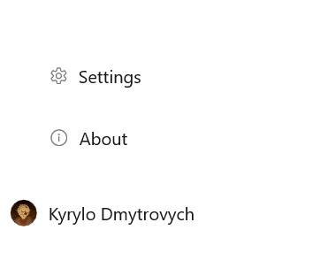

---
layout:
  title:
    visible: true
  description:
    visible: true
  tableOfContents:
    visible: true
  outline:
    visible: true
  pagination:
    visible: false
---

# 📺 Interface

<figure><figcaption>
You may have a slightly different interface, e.g. less/more data.
</figcaption></figure>



Menu items where you can upload files/folders or create a folder. You can also search through all folders

.png>)



App settings and about the app




The most root folders that there are at all, you can create other folders here

.png>)



File statistics, how many videos or photos. What is the weight of all files. Or what files have been downloaded or uploaded

.png>)



Last uploaded files

.png>)



